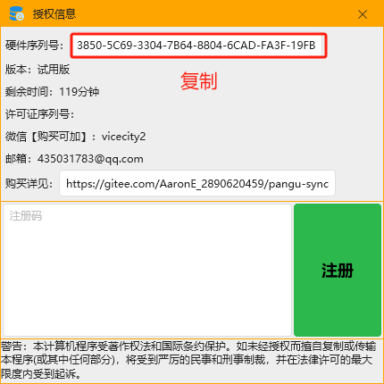
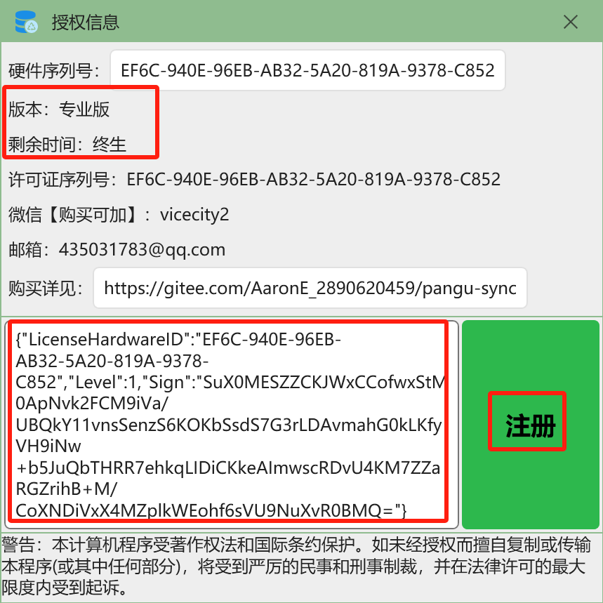

# 👉PanguSync 8.12 [下载地址](https://pan.baidu.com/s/1WesHaKGO7uQMhPNE-BTDmg?pwd=abcd#list/path=%2F)

#### 📘【版权声明】本软件是PanguHA的子模块，受著作权法严格保护，任何未经授权的反编译、篡改、二次售卖均构成盗版行为，我们将依法追究相关责任人的法律责任！！！

##   🌵简介
针对全量比对型软件的高延迟高能耗、日志型软件的配置复杂等缺点，PanguSync独创了一种新型数据库增量同步技术，具备易配置、低延迟、低能耗、高容错等优点。源一旦发生变化，可准实时同步到目标。Mysql/Sqlserver数据库同步爱好者一旦使用该软件，将如获至宝，就如修行者获得了一本门槛极低的高等修行功法。
##  ☀️爽快人购买
1. 购买方式：微信【vicecity2】、支付宝、银行卡、淘宝
2. 可签[**合同**](https://pan.baidu.com/s/1U7jMJv-76q36T6diGwAVug?pwd=abcd#list/path=%2F)，可开[**发票**](https://pan.baidu.com/s/1U7jMJv-76q36T6diGwAVug?pwd=abcd#list/path=%2F)
3. 一机一码

|  |试用版|体验版|专业版 | 企业版  | 至尊版 |
|---|---|---|---|---|---|
| **$\color{red}{1}$个注册码售价**  |免费  | **￥499**  $\color{blue}{联系微信购买 }$   |  **￥1000**  [**[购买]**](https://item.taobao.com/item.htm?ft=t&id=754824495442)|   **￥1500**  [**[购买]**](https://item.taobao.com/item.htm?id=761877111372)|   **￥1600**   [**[购买]**](https://item.taobao.com/item.htm?ft=t&id=767418824294) |
| 任务数量 |  5   |50   |500   |  2000  |  不限 |
|授权期限|   2h/次（次数不限） | 终生  &nbsp;&nbsp;&nbsp;&nbsp;  | 终生  &nbsp;&nbsp;&nbsp;&nbsp;  |  终生  &nbsp;&nbsp;&nbsp;&nbsp; |  终生  &nbsp;&nbsp;&nbsp;&nbsp; | 
| 发票 | ❌|❌| ✔️  |✔️  |  ✔️ | 

### 🔥某三甲医院云胶片热备案例【$\color{red}{亿级}$】https://www.bilibili.com/video/BV14x4y167A2/?spm_id_from=333.999.0.0&vd_source=8db0f4c511ee648e595718cb636c8df7

### 🔰如何注册(无需联网)
 **购买时提供硬件序列号，收到注册码后，在文本框内填入，点击注册** 
  

 ### 📜教程
- 🔥[**_PanguSync,一款windows数据库同步软件_**](https://zhuanlan.zhihu.com/p/680995986)
- 🔥[**_一款超好用的增量数据准实时同步工具PanguSync_**](https://zhuanlan.zhihu.com/p/686039921)
- 👪[**_一主多从同步教程_**](https://blog.csdn.net/sss899000/article/details/146512375)
- 🌈[**_PanguSync常见错误解决方法_**](https://blog.csdn.net/sss899000/article/details/139549129)
- 🚴[**_如何跳过初始数据直接进行增量同步_**](https://blog.csdn.net/sss899000/article/details/146609891)
- 👫[**_关于字段自动映射功能的说明_**](https://blog.csdn.net/sss899000/article/details/146909189)

### 🔯同步模式

| 模式| 示例 |支持|读写| 注意事项 |
|---|---|---|---|---|
| 单向| A➔B |✔️  |A写B读|/|
| 双向|A⇆B|✔️  |A写B读或B写A读|编辑界面请$\color{red}{取消}$【特殊模式】|
| 广播|A➔B，A➔C，...，A➔Z|✔️  |A写N读|/|
| 链式| A➔B➔C➔......➔Z |✔️  |A写N读|编辑界面请$\color{green}{勾选}$【特殊模式】|
| 链式扩展|  |✔️  |A写N读|编辑界面请$\color{green}{勾选}$【特殊模式】|

### 📢注意事项
- 👿不建议开杀毒实时防控，可能会影响性能
- ⚡️选库不选表可批量生成任务
- 🔄【A⇆B】模式部署步骤：假设A为主节点，B为备节点，先truncate清空B节点(不要使用delete)，新建B➔A的任务，待运行成功后，再新建A➔B的任务运行，等待A➔B全量同步完成，后续进行增量同步。并且需要注意IP需要相互对应，即【A➔B】任务的源IP与【B➔A】任务的目标IP相同，反之亦然
- ♓️ **编辑界面【配置项】勾选【$\color{red}{源新增字段时，若目标端也存在该字段，将进行自动映射，无需重新编辑任务}$】后，可实现字段自动映射功能。如果源和目标异构，即大部分字段名称都不相同，建议不要勾选此项，避免源新增字段刚好和目标某个字段名称一样，就自动映射了，而这个字段可能你并不想同步它。** 

### ㊙️关于开机自启动
- 将软件设置为快捷方式，然后Win+R输入shell:startup，将快捷方式拖入该目录
- Win+R输入control userpasswords2，取消【要使用本计算机，用户必须输入用户名和密码】
- 付费版可以自动运行任务，在Config文件夹下面添加一个AutoStart.txt文件即可

