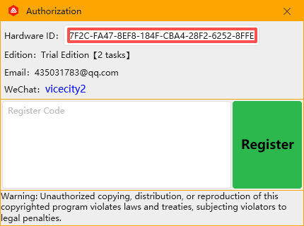

###   🌵Brief introduction
PanguSync is a cross platform database synchronization software that can run on Windows/Linux. It has created a unique incremental synchronization technology for databases, which not only solves the high energy consumption and high latency of full comparison software, but also avoids the complex configuration of logging software. It is a superior technique and can be regarded as a niche skill. It can obtain SQL server/MySQL/PostgreSQL incremental changes (insert, update, delete) in milliseconds without the need for CDC/Binlog/WAL. On this basis, multiple synchronization modes are adapted, supporting bidirectional [A ⇆ B], broadcast [A → B, A → C], and chain [A → B → C]. In order to ensure supreme stability, functions such as self increasing primary key error correction, bidirectional reflux blocking, unique constraint error correction, foreign key constraint error correction, and segment detection mapping are built-in.

### 📚图文教程
- 📜[PanguSync manual【Must-see】](https://www.cnblogs.com/SuperCCSoft/p/19470393)

### 🎮OS support
- Windows7/Windows Server 2008R2 or above
- Ubuntu 16/CentOS 7 or above

### 💾​​Database support
|  Database |Version   |
|---|---|
| Mysql  | 5.6.4 or above  |
| Sqlserver  |2008R2 or above   |
| PostgreSQL| 9.5 or above  |

### 📟Interface

### PanguSync 15 for Windows

### PanguSync 15 for Linux(Ubuntu)

### 🔯Synchronous mode

| Mode| Example |Support| Applicable scenarios| Precautions|
|---|---|---|---|---|
| one-way| A➔B |✔️  |A Write B Read|/|
| two-way|A⇆B|✔️  |Data dual machine hot backup [non dual write scenario]| Please uncheck 'Special Mode' in the editing interface|
|  broadcast|A➔B，A➔C，...，A➔Z|✔️  |A write N read|/|
| Chain type| A➔B➔C➔......➔Z |✔️  |A write N read|Please check 'Special Mode' in the editing interface|
| Chain extension|  |✔️  |A write N read|Please check 'Special Mode' in the editing interface|

### ㊙️Regarding the self startup upon startup
- Set the software as a shortcut, then [Win+R] enter [shell: startup] and drag the shortcut into the directory
- Win+R input 'control userpasswords2', cancel 'To use this computer, the user must enter a username and password'
- The paid version can automatically run tasks. Simply add an AutoStart.txt file to the 'Config' folder

### 🔰How to register
Provide the Hardware ID when purchasing, and you can register yourself after receiving the registration code 

### ☀️Purchase

https://item.taobao.com/item.htm?ft=t&id=1004081816229

