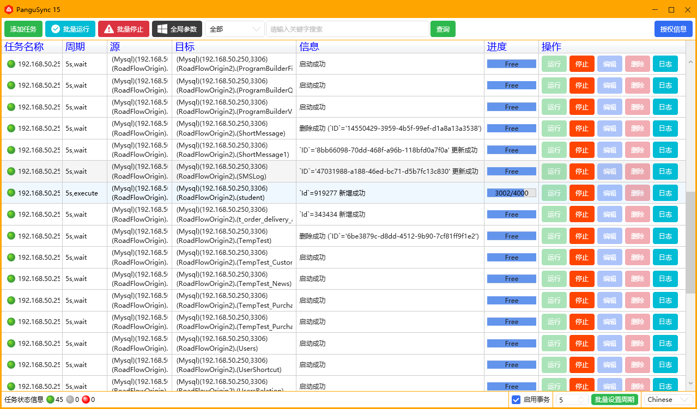
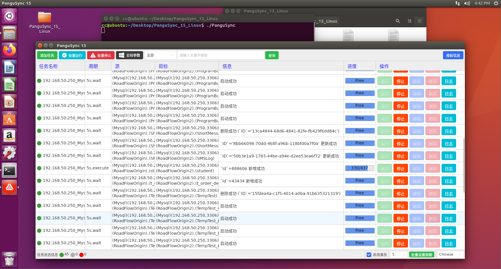
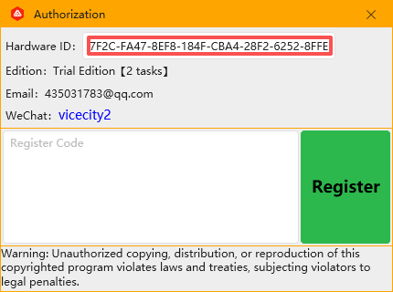
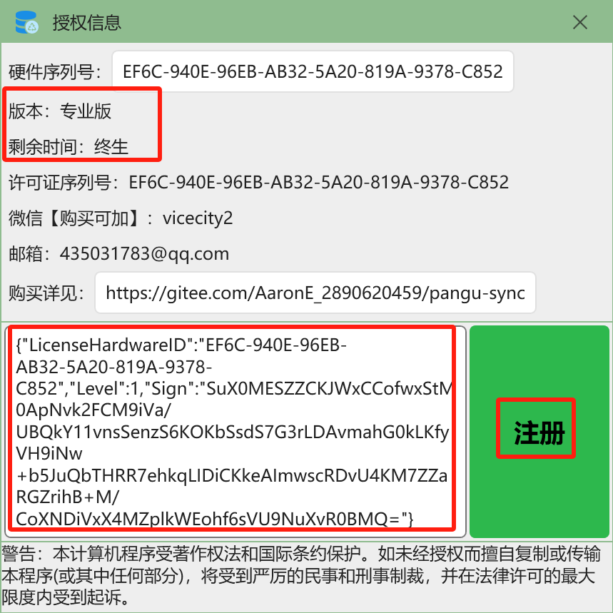

###   🌵Brief introduction
PanguSync is a cross platform database quasi real time synchronization software that can run on Windows/Linux. It has created a unique database incremental synchronization technology, which is different from full comparison software and log software. It not only avoids high energy consumption and high latency, but also avoids complex configuration. It does not rely on logs but can obtain SQL server/MySQL/PostgreSQL data changes (add, delete, modify) in milliseconds. On this basis, multiple synchronization modes are adapted, supporting bidirectional [A ⇆ B], broadcast [A → B, A → C], and chain [A → B → C]. To ensure supreme stability, built-in functions include self increasing primary key value/sequence value correction, bidirectional backflow blocking, unique constraint conflict ignore, foreign key constraint conflict correction, field detection mapping, etc.

### 📚Tutorial
- 📜[PanguSync manual【Must-see】](https://www.cnblogs.com/SuperCCSoft/p/19470393)

### 🗽​​Database Support
| Source\Target Full quantity+incremental |Mysql 5.6.4 or above |Sqlserver 2008R2 or above   |PostgreSQL 9.5 or above  |
|---|---|---|---|
| **Mysql**   **5.6.4 or above**   |   ✔️| ✔️| ✔️|
|  **Sqlserver**   **2008R2 or above**    |  ✔️| ✔️| ✔️|
|  **PostgreSQL**   **9.5 or above**   | ✔️ | ✔️| ✔️|

### 📟Interface

### PanguSync 15 for Windows

### PanguSync 15 for Linux

### 🔯Synchronous mode

| Mode| Example |Support| Applicable scenarios| Precautions|
|---|---|---|---|---|
| one-way| A➔B |✔️  |A Write B Read|/|
| two-way|A⇆B|✔️  |Data dual machine hot backup [non dual write scenario]| Please uncheck 'Special Mode' in the editing interface|
|  broadcast|A➔B，A➔C，...，A➔Z|✔️  |A write N read|/|
| Chain type| A➔B➔C➔......➔Z |✔️  |A write N read|Please check 'Special Mode' in the editing interface|
| Chain extension|  |✔️  |A write N read|Please check 'Special Mode' in the editing interface|

### 🔰How to register
Provide the Hardware ID when purchasing, and you can register yourself after receiving the registration code 

### ☀️Purchase

https://item.taobao.com/item.htm?ft=t&id=1004081816229

- No network required, offline one machine one code permanent authorization
- **Exclusive to the entire network: Easy incremental real-time synchronization, experience it immediately!!!** 

